<!-- Please do not change this logo with link -->

# Analog Read Serial Write

This example shows how to configure the UART, and ADC on the PIC18F57Q43 Curiosity Nano using MPLAB Code Configurator (MCC) to do an analog conversion and display it on a terminal. The example uses the ADCC module to do the analog conversion and the UART to transmit the data to the terminal using data streamers.

</a>

## Related Documentation

- [MPLAB Code Configurator](https://www.microchip.com/en-us/development-tools-tools-and-software/embedded-software-center/mplab-code-configurator)
- [PIC18-Q43 Family Product Page](https://www.microchip.com/en-us/products/microcontrollers-and-microprocessors/8-bit-mcus/pic-mcus/pic18-q43)

## Software Used

- [MPLAB® X IDE](http://www.microchip.com/mplab/mplab-x-ide) **6.15** or newer
- [MPLAB® XC8](http://www.microchip.com/mplab/compilers) **2.45** or a newer compiler
- [MPLAB® Code Configurator (MCC)](https://www.microchip.com/mplab/mplab-code-configurator) **5.3.7** or newer
- [PIC18F-Q_DFP](https://packs.download.microchip.com/) **1.23.425**  or newer Device Pack

## Hardware Used

- [Microchip PIC18F57Q43 Curiosity Nano Evaluation Kit](https://www.microchip.com/developmenttools/ProductDetails/DM164150)
- [MikroElektronika - POT 3 click](https://www.mikroe.com/pot-3-click)
- [Microchiop Curiosity Nano Base for Click boards](https://www.microchip.com/developmenttools/ProductDetails/AC164162)

### Hardware User Guide

In this project we will read the analog signal from the potentiometer and send it to the PC.

To be able to read the value we would have to configure the Analog Digital Converter (ADC) to read the value from the correct pin.

When using the Curiosity Nano Adapter with the POT 3 click in space **1** we can read that Analog 1 - AN1 is connected to PORTA - RA0 on the **PIC18F57Q43**.

## Setup

MCC with the Melody library was used to implement this example as shown in the following section.

## ADCC Configuration

In the Device Resources window click the dropdown arrow next to Drivers to expand the choices.

In the Device Resources window scroll to find ADCC click the dropdown arrow to expand the choices. Click the green plus symbol to add the driver to the project.

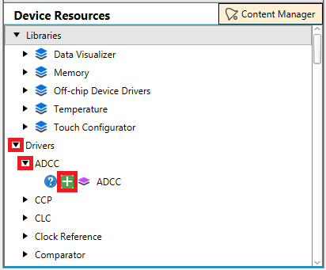

The ADCC was used in this code example to periodically measure the analog channel RA0 (POT) which is connected to a 10 kΩ potentiometer on the POT3 Click board. The ADCC was programmed to use Timer1 as an auto-conversion trigger in order to core-independently perform a conversion every 15 ms. Additionally, the computation feature of the ADCC was utilized in this example to perform a burst average conversion core independently every time the ADC gets triggered. The ADCC was setup in such a way where it takes 32 consecutive conversions and accumulates the results whenever triggered, and then automatically divides the results by 32 by right shifting the accumulated value by 5 to provide the filtered average ADC result. The MPLAB Code Configurator (MCC) was used to setup the ADCC module for this code example as shown below.

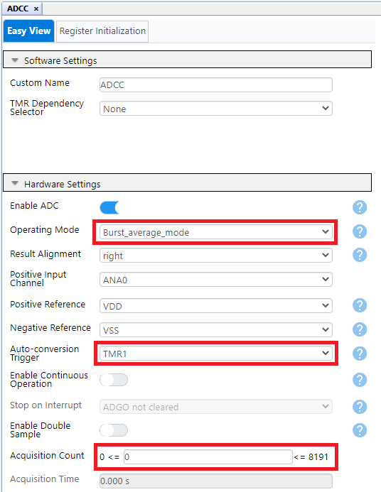

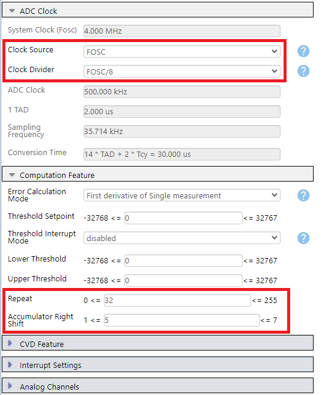

## Timer 1 (TMR1) Module

In the Device Resources window click the dropdown arrow next to Drivers to expand the choices.

In the Device Resources window scroll to find TMR1 click the dropdown arrow to expand the choices. Click the green plus symbol to add the driver to the project.

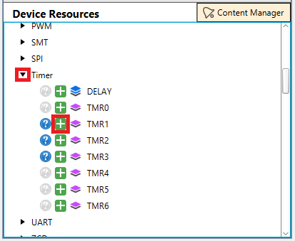

The Timer1 module in this example was used as the ADCC auto-conversion trigger source, meaning that every time Timer1 overflows/rolls over the ADC will be triggered in hardware to begin a conversion. The Timer1 clock source selected was MFINTOSC_31.25kHz with no prescaler, and the Timer1 period was configured to be 15 ms. By selecting Timer1 as the auto-conversion trigger source in the ADCC Easy View Window, no other actions or setup is needed for the Timer1 work with the ADC in this manner.  The MPLAB Code Configurator (MCC) was used to configure the Timer1 module for this code example as shown below.

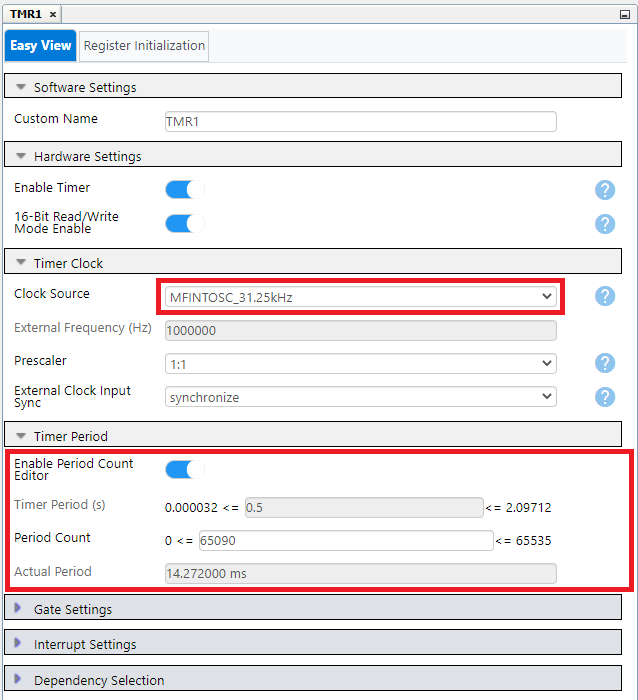

## Data Streamer Configuration

In the Device Resources window click the dropdown arrow next to Drivers to expand the choices.

In the Device Resources window scroll to find Data Visualizer click the dropdown arrow to expand the choices. Click the plus symbol next to Data Streamer to add the module to the project.

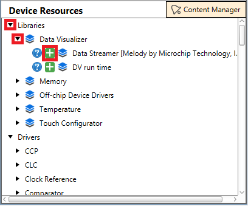

There will be three variables that are being watched in this example: An uint16_t Measurement, an int16_t Inverse, and an int8 Counter.
The order and variables matter so it's important to stay consistent to avoid confusion.

- Measurement is the actual 16-bit ADC reading being taken and filtered
- Inverse is a negative 16-bit reflection across the Y axis of Measurement
- Counter is an 8-bit unit that is forever overflowing and restarting its own count

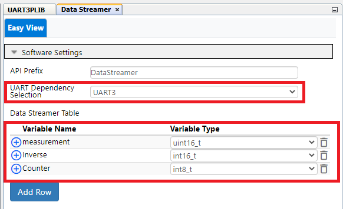

In the newly created **UART3PLIB** keep everything default.

## Pin Configuration

These will be the only configured pins for this project.

|Pin|Function|
|----|----|
|RA0|ADC input pin|
|RF0|UART3 TX|
|RF1|UART3 TX|

In the **Pins** tab, pins can be configured with a custom pin name in this case the pins are called by their function to make the generated API more readable. Also make sure the analog option is selected for RA0/POT.

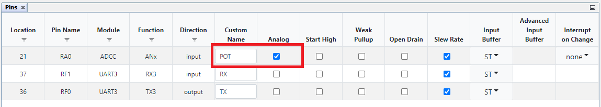

**Pins Grid View**

In the **Pins Grid View** find ANx for the input pin to the ADC module. AN1 coming from the Click 1 position is connected to RA0 selected as an output by clicking the corresponding padlock symbol. Do the same for the UART TX/RX.

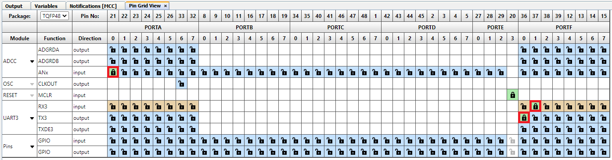

### Generating Project

- Right click on **Generate** button.
   - Force update on all.
- Left Click **Generate** button.

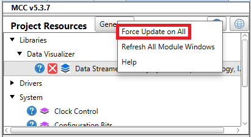

After programming the device we would like to use the *Data Visualizer* to see the output.
Configure the device with **9600** baud rate and connect to it.

If you have to install the Data Visualizer plugin click on **Tools**, then **Plugins**, then **Available plugins**. Select checkbox for MPLAB Data Visualizer click on **Install** button. To start Data Visualizer click the button as shown below.

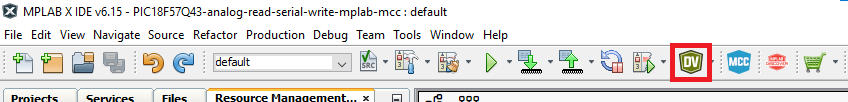

The plugin shows up in the Kit window on it's own tab.

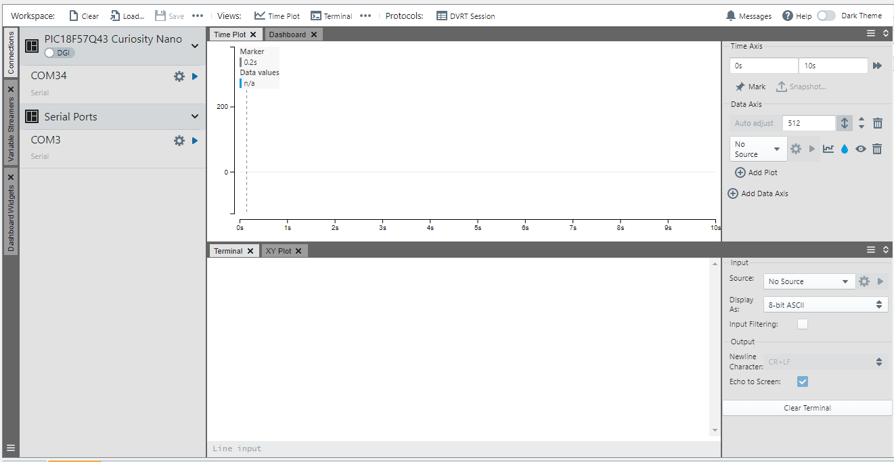

Taking a look at the main.c the data is actually being organized into three different variables, this way it is possible to differentiate data and individually plot each variable using data streamers.
The following steps will introduce the data streamer, how to configure it and how to read them as well.

1. Click on **Variable Streamers** tab on the left side.
2. Click **New Variable Streamer** button.

**Variable Streamer Window**

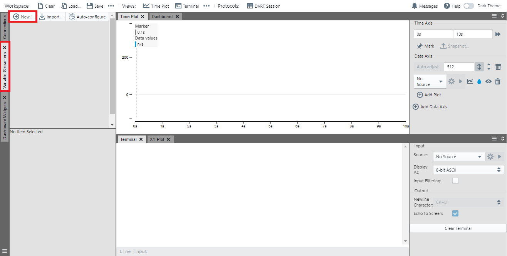

Since we are dealing with three variables it is important to set this up correctly. The data streamer works by sending hex values through the dedicated UART, these values correspond to the actual variables that are being sent. In each transaction there is a start and stop condition, and data in-between. Below is the setup, earlier it was mentioned that the order and size matters, that is the case here. Each variable is associated with a byte position indicating where in the hex values this variable is located.

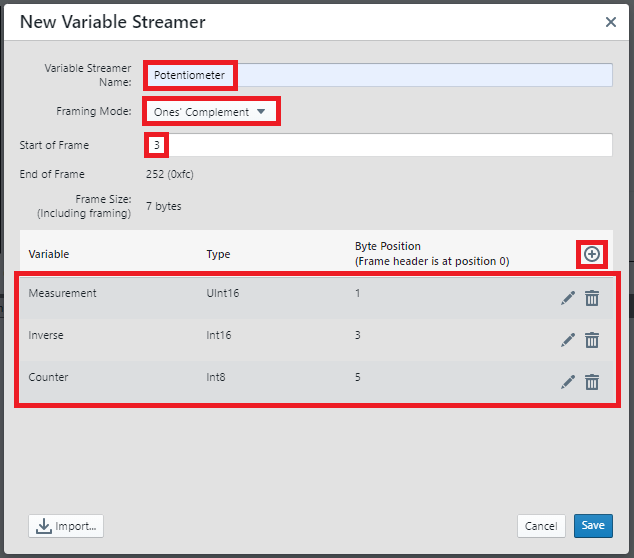

*Click Save!*

To be able to use this variable, connect the devices COM-port to this variable just created.

**Click *Start Streaming COMx***

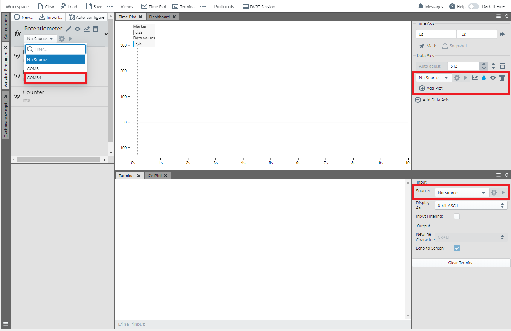

To be able to graph the measurement, select PIC18F57Q43 Curiosity Nano as the source under **Variable Streamers**. To display the line graph there need to be two additional plots in order to view the variables sending together.

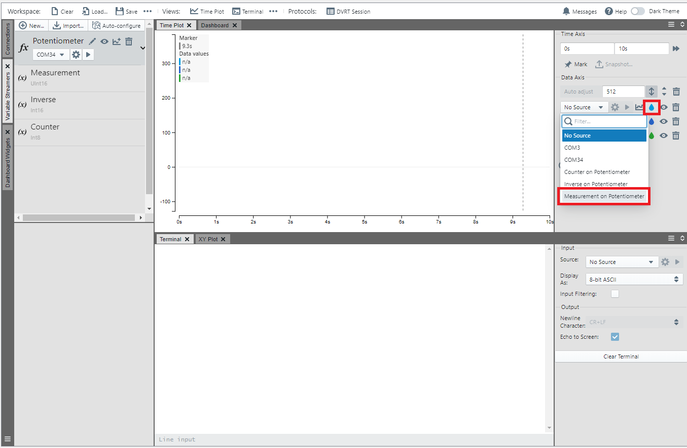

The source needs to be selected for every plot, when the plots have their own sources, press play under Potentiometer to start the serial read. Optionally, the **Terminal** source can be set to the COM corresponding to the PIC-Q43, this will display the hex values being sent by the UART.

**Plot Variable**

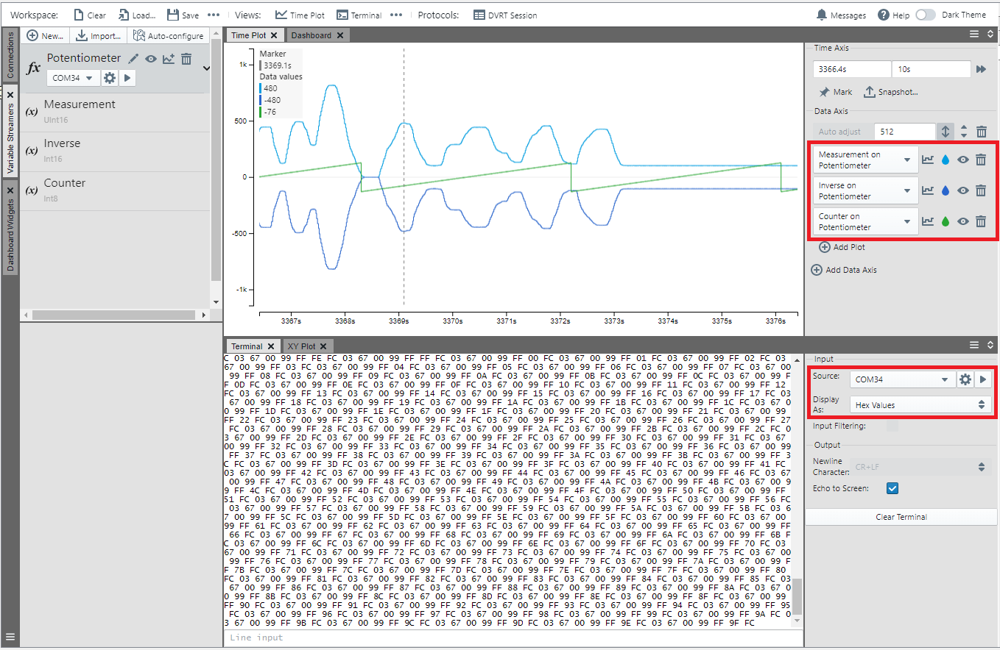

When you have done this, you would expect to get a similar output as the graph above. The lines represent a set of turns done on the potentiometer, along with a couple counts made by the counter. Colors for the lines can be changed with the Water Drop Icon. Below that is the hex values expected by this transaction.

## Operation

After having flashed the application to the PIC18F57Q43 Curiosity Nano, the ADC will poll the POT3 Click board do the conversion and return the value on the UART showing on the Data Visualizer.

## Summary

The example has shown how MCC can be used to easily configure the ADC to sample an analog signal from a pin and send it over UART to the Data Visualizer.
