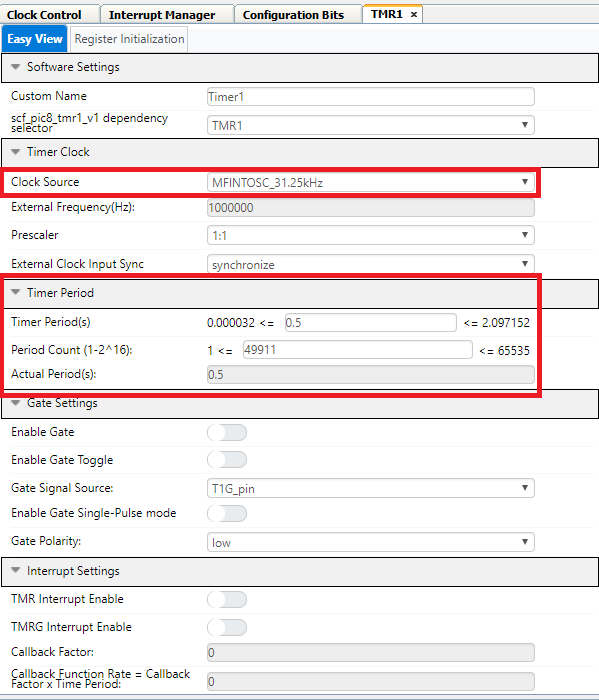

<!-- Please do not change this logo with link -->

# Analog Read Serial Write

This example shows how to configure the ADCC, and UART on the PIC18F57Q43 Curiosity Nano using MPLAB Code Configurator (MCC) to do an analog conversion and display it on a terminal. The example uses the ADCC module to do the analog conversion and the UART to transmit the data to the terminal.

</a>

## Related Documentation

- [MPLAB Code Configurator](https://www.microchip.com/en-us/development-tools-tools-and-software/embedded-software-center/mplab-code-configurator)
- [PIC18-Q43 Family Product Page](https://www.microchip.com/en-us/products/microcontrollers-and-microprocessors/8-bit-mcus/pic-mcus/pic18-q43)

## Software Used

- [MPLAB® X IDE](http://www.microchip.com/mplab/mplab-x-ide) **5.45** or newer 
- [MPLAB® XC8](http://www.microchip.com/mplab/compilers) **2.31** or a newer compiler 
- [MPLAB® Code Configurator (MCC)](https://www.microchip.com/mplab/mplab-code-configurator) **4.1.0** or newer 
- [MPLAB® Melody Library](https://www.microchip.com/mplab/mplab-code-configurator) **1.37.24** or newer 
- PIC18F-Q_DFP **1.11.185** or newer Device Pack

## Hardware Used

- [Microchip PIC18F57Q43 Curiosity Nano Evaluation Kit](https://www.microchip.com/developmenttools/ProductDetails/DM164150)
- [MikroElektronika - POT 3 click](https://www.mikroe.com/pot-3-click)
- [Microchiop Curiosity Nano Base for Click boards](https://www.microchip.com/developmenttools/ProductDetails/AC164162)

### Hardware User Guide

In this project we will read the analog signal from the potentiometer and send it to the PC.

To be able to read the value we would have to configure the Analog Digital Converter (ADC) to read the value from the correct pin.  
When using the *Curiosity Nano Adapter* with the *POT 3 click* in space **1** we can read that Analog 1 - AN1 is connected to PORTA - RA0 on the **PIC18F57Q43**
  

## Setup

MCC with the Melody library was used to implement this example as shown in the following section.
## ADCC Configuration
In the *Device Resources* window click the dropdown arrow next to *Drivers* to expand the choices

In the *Device Resources* window scroll to find *ADCC* click the dropdown arrow to expand the choices. Click the green plus symbol to add the driver to the project.

The ADCC was used in this code example to periodically measure the analog channel RA0 (POT) which is connected to a 10kΩ potentiometer on the POT3 Click board. The ADCC was programmed to use Timer1 as an auto-conversion trigger in order to core-independently perform a conversion every 500ms. Additionally, the computation feature of the ADCC was utilized in this example to perform a burst average conversion core independently every time the ADC gets triggered. The ADCC was setup in such a way where it takes 32 consecutive conversions and accumulates the results whenever triggered, and then automatically divides the results by 32 by right shifting the accumulated value by 5 to provide the filtered average ADC result. The MPLAB Code Configurator (MCC) was used to setup the ADCC module for this code example as shown below.

## Timer 1 (TMR1) Module
The Timer1 module in this example was used as the ADCC auto-conversion trigger source, meaning that every time Timer1 overflows / rolls over the ADC will be triggered in hardware to begin a conversion. The Timer1 clock source selected was MFINTOSC_31.25kHz with no prescaler, and the Timer1 period was configured to be 500ms. By selecting Timer1 as the auto-conversion trigger source in the ADCC easy view window, no other actions or setup is needed for the Timer1 work with the ADC in this manner.  The MPLAB Code Configurator (MCC) was used to configure the Timer1 module for this code example as shown below.

## UART Configuration
In the *Device Resources* window click the dropdown arrow next to *Drivers* to expand the choices.

In the *Device Resources* window scroll to find *UART3* click the dropdown arrow to expand the choices. Click the plus symbol next to UART3 to add the module to the project.

In the *UART3 Easy View* select Redirect STDIO to UART, and Desired Baud Rate **9600**.

## Pin Configuration
In the *Pins Grid View* find ANx for the input pin to the ADC module. AN1 coming from the Click 1 postition is connected to RA0. selected as an output by clicking the corresponding padlock symbol.

In the Pins tab, RA0 can be configured with a custom pin name in this case we called it POT to make the generated API more readable. 

In the *Pins Grid View* find UART3 RX3 and TX3 for the connections for the Serial communications int the PIC18F57Q43 cnano. Select TX3 and RX3 as shown in figure below with the coresponding padlock symbol.

**Pins Grid View**

## Data Streamer Configuration
In the *Device Resources* window click the dropdown arrow next to *Drivers* to expand the choices. Find *Data Streamer Driver* and click the green plus symbol to add the driver to the solution.

In the Data Streamer Driver window select dropdown menu for UART Dependency Selection and select UART3. Click the *Variable Name* and type measurement select dropdown box for *Variable Type* and select uint16_t.

### Generating project

1. Right click on **Generate** button
   1. Force update on all
2. Left Click **Generate** button 

After programming the device we would like to use the *Data Visualizer* to see the output. 
Configure the device with **9600** baud rate and connect to it.

If you have to install the *Data Visualizer* plugin click on Tools => Plugins => Available plugins. Select checkbox for MPLAB Data Visualizer click on Intall button. To start *Data Visualizer* click the button as shown below

The plugin shows up in the kit window on it's own tab.

Taking a look at the main.c file, we can see that the *ADC* measurement is not sent directly, but split into chunks. This is done because we can only send 8-bits and we want to send the 16-bit value that comes from the ADC.
To visulize this, we need to take special care and create something called a variable that will merge the result into one 16-bit value.

Click the create variable button

Since we are dealing with a unsigned 16-bit value, choose that when you create this. Start value and end value must be the same as in the main.c file.

Click Save!

To be able to use this variable, connect the devices COM-port to this variable just created.

Click *Start Streaming COMx*

To be able to graph the measurement, click *Variable Streamers*. Select PIC18F57Q43 Curiosity nano 

*Plot variable*.

When you have done this, you would expect to get a similar output as the graph above.

## Operation

After having flashed the application to the PIC18F57Q43 Curiosity Nano, the ADC will poll the POT3 Click board do the conversion and return the value on the UART showing on the Data Visualizer.

## Summary

The example has shown how MCC can be used to easily configure the ADC to sample an analog signal from a pin and send it over UART to the Data Visualizer.
